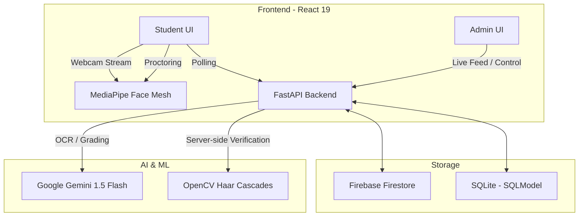
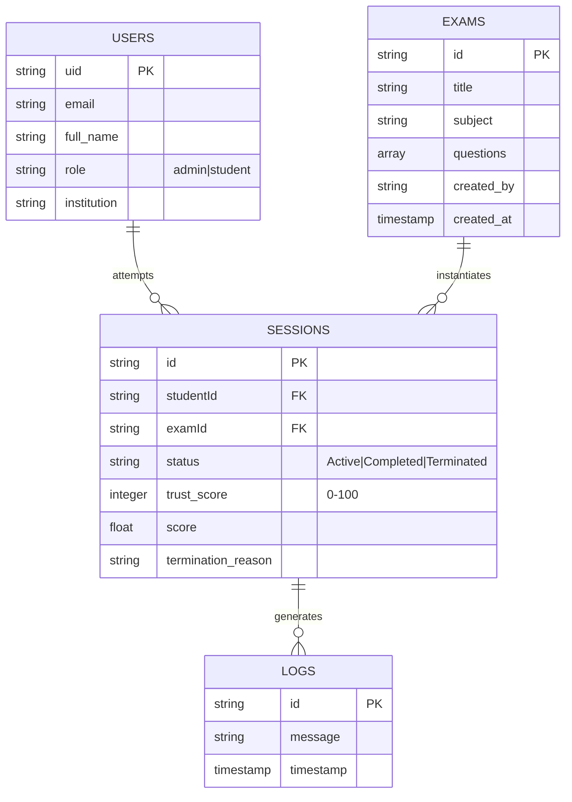

# SecureEval — AI-Powered Exam Proctoring Platform


**SecureEval** is a comprehensive, enterprise-grade AI-powered online exam proctoring system. It combines real-time computer vision, automated AI grading, and a high-performance administration dashboard to ensure academic integrity in remote assessments.

---

## 🏗️ System Architecture

SecureEval uses a modern, distributed architecture to handle real-time monitoring and heavy AI workloads.



---

## 🛠️ Technology Stack

### Frontend (SPA)
| Layer | Technology | Purpose |
| :--- | :--- | :--- |
| **Framework** | [React 19](https://react.dev/) | Component-based UI with fast reconciliation. |
| **Build Tool** | [Vite 7](https://vitejs.dev/) | Ultra-fast HMR and optimized production builds. |
| **Computer Vision** | [MediaPipe Face Mesh](https://developers.google.com/mediapipe) | Real-time tracking of 478 3D facial landmarks. |
| **State/Routing** | React Context + Router 7 | Role-aware navigation and global authentication. |
| **Styling** | Vanilla CSS (Glassmorphism) | Premium, responsive, and translucent UI design. |
| **Charts** | [Recharts 3](https://recharts.org/) | Dynamic reporting and performance analytics. |

### Backend (REST API)
| Layer | Technology | Purpose |
| :--- | :--- | :--- |
| **Framework** | [FastAPI](https://fastapi.tiangolo.com/) | High-performance asynchronous Python framework. |
| **Web Server** | [Uvicorn](https://www.uvicorn.org/) | Lightning-fast ASGI server. |
| **AI LLM** | [Google Generative AI](https://deepmind.google/technologies/gemini/) | OCR (Paper extraction) and Automated Descriptive Grading. |
| **Proctoring** | [OpenCV](https://opencv.org/) | Server-side face count verification via Haar Cascades. |
| **Database** | [SQLModel](https://sqlmodel.tiangolo.com/) | SQL database interactions with Pydantic & SQLAlchemy. |
| **Security** | [Firebase Admin SDK](https://firebase.google.com/docs/admin) | Identity management and real-time database access. |

---

## 🗄️ Database Schemas

### 1. Cloud Storage (Firebase Firestore)
The primary production database for real-time synchronization and session tracking.



### 2. Local/Legacy Storage (SQLModel/SQLite)
Used for local testing or secondary structured data caching.

| Table | Primary Keys | Relationships |
| :--- | :--- | :--- |
| **`Student`** | `id (int)` | N/A |
| **`Exam`** | `id (int)` | `questions` (1:N) |
| **`Question`** | `id (int)` | `exam_id` (FK) |
| **`ExamSession`** | `id (int)` | `logs` (1:N), `student_id` |
| **`MonitoringLog`** | `id (int)` | `session_id` (FK) |

---

## 👁️ AI & Proctoring Core

### 1. Computer Vision Logic (Face Mesh)
The `FaceMeshService` processes webcam frames locally to detect cheating.

- **Landmarking**: Tracks **478 3D points** for high-precision head pose estimation.
- **Monitoring Math**:
    - **Yaw (Side Turn)**: Calculated as `Math.abs(nose.x - midpoint_cheeks.x)`. Threshold: `> 0.12`.
    - **Pitch (Up/Down)**: Relative vertical position of nose tip between forehead and chin.
      - **Looking Up**: `pose_y < 0.25`
      - **Looking Down**: `pose_y > 0.75` (Flagged as potential phone usage).
- **Face Count**:
    - `count == 0`: `NO_FACE` status (Immediate termination).
    - `count > 1`: `MULTIPLE_FACES` status (Immediate termination).

### 2. Generative AI Pipeline (Gemini 1.5 Flash)
- **OCR Engine**: Extracts structured JSON from uploaded exam papers (images/PDFs).
  - *Prompt*: *"Extract questions... return JSON with 'questions' array including text, options, and correct answers."*
- **Auto-Grading**: Grades descriptive (long-form) answers by comparing semantic meaning against expected keywords.
  - *Logic*: Returns a partial score (0.0 to 1.0) and detailed feedback.

---


---

## 🚀 Getting Started

### Prerequisites
- **Node.js**: v18+
- **Python**: v3.11+
- **Firebase Account**: Set up Firestore and Auth.
- **Gemini API Key**: Obtain from [Google AI Studio](https://aistudio.google.com/).

### Local Installation
1. **Clone the Repo**:
   ```bash
   git clone https://github.com/shoibahmad/Cheating-tracker.git
   cd Cheating-tracker
   ```
2. **Backend Setup**:
   ```bash
   cd backend
   pip install -r requirements.txt
   # Configure .env with GEMINI_API_KEY and FIREBASE_CREDENTIALS
   uvicorn main:app --reload
   ```
3. **Frontend Setup**:
   ```bash
   cd frontend
   npm install
   npm run dev
   ```

---

## 🛡️ Security & Integrity
- **Restricted Access**: Mobile devices and small screens are blocked from taking exams.
- **Anti-Switching**: Tab switching or minimizing the browser triggers an immediate violation log and trust score penalty.
- **Role Isolation**: Admin APIs are protected using Firebase Admin custom claims, ensuring students cannot access monitoring data.
