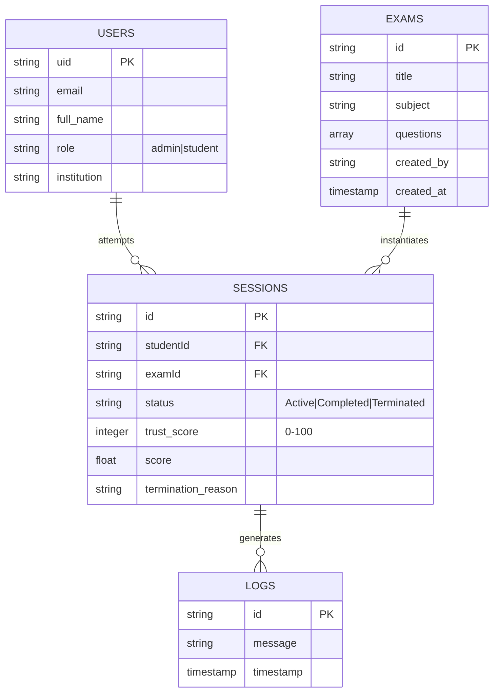

# SecureEval — AI-Powered Exam Proctoring Platform


**SecureEval** is a comprehensive, enterprise-grade AI-powered online exam proctoring system. It combines real-time computer vision, automated AI grading, and a high-performance administration dashboard to ensure academic integrity in remote assessments.

---

## 🏗️ System Architecture

SecureEval uses a modern, distributed architecture to handle real-time monitoring and heavy AI workloads.

```mermaid
graph TD
    subgraph Client [Frontend - React 19]
        A[Student UI] -->|Webcam Stream| E[MediaPipe Face Mesh]
        A -->|Polling| B[FastAPI Backend]
        F[Admin UI] -->|Live Feed / Control| B
    end
    
    subgraph Database [Storage]
        C[Firebase Firestore]
        G[SQLite - SQLModel]
    end
    
    subgraph Services [AI & ML]
        B -->|OCR/Grading/Consistency| D[Google Gemini 2.5 Flash]
        A -->|Proctoring (Face/Gaze)| E
        A -->|Object Detection (Smartphones)| I[TFJS COCO-SSD]
        B -->|Server-side Verification| H[OpenCV Haar Cascades]
    end

    B <--> C
    B <--> G
```

---

## 🛠️ Technology Stack

### Frontend (SPA)
| Layer | Technology | Purpose |
| :--- | :--- | :--- |
| **Framework** | [React 19](https://react.dev/) | Component-based UI with fast reconciliation. |
| **Build Tool** | [Vite 7](https://vitejs.dev/) | Ultra-fast HMR and optimized production builds. |
| **Testing** | [Vitest](https://vitest.dev/) + [React Testing Library](https://testing-library.com/) | Component and integration testing. |
| **Computer Vision** | [MediaPipe Face Mesh](https://developers.google.com/mediapipe) | Real-time tracking of 478 3D facial landmarks. |
| **State/Routing** | React Context + Router 7 | Role-aware navigation and global authentication. |
| **Styling** | Vanilla CSS (Glassmorphism) | Premium, responsive, and translucent UI design. |
| **Charts** | [Recharts 3](https://recharts.org/) | Dynamic reporting and performance analytics. |

### Backend (REST API)
| Layer | Technology | Purpose |
| :--- | :--- | :--- |
| **Framework** | [FastAPI](https://fastapi.tiangolo.com/) | High-performance asynchronous Python framework. |
| **Web Server** | [Uvicorn](https://www.uvicorn.org/) | Lightning-fast ASGI server. |
| **Testing** | [pytest](https://pytest.org/) + [pytest-cov](https://pytest-cov.readthedocs.io/) | Unit and integration testing with coverage. |
| **Linting** | [Ruff](https://docs.astral.sh/ruff/) | Fast Python linter and formatter. |
| **AI LLM** | [Google Generative AI](https://deepmind.google/technologies/gemini/) | OCR, Automated Grading, and Style Consistency Analysis. |
| **Object Detection** | [TensorFlow.js](https://www.tensorflow.org/js) | Real-time prohibited item detection (books, phones). |
| **Proctoring** | [OpenCV](https://opencv.org/) | Server-side face count verification. |
| **Database** | [SQLModel](https://sqlmodel.tiangolo.com/) | SQL database interactions with Pydantic & SQLAlchemy. |
| **Security** | [Firebase Admin SDK](https://firebase.google.com/docs/admin) | Identity management and real-time database access. |

---

## 🗄️ Database Schemas

### 1. Cloud Storage (Firebase Firestore)
The primary production database for real-time synchronization and session tracking.


```mermaid
erDiagram
    USERS {
        string uid PK
        string email
        string full_name
        string role "admin|student"
        string institution
    }
    EXAMS {
        string id PK
        string title
        string subject
        array questions
        string created_by
        timestamp created_at
    }
    SESSIONS {
        string id PK
        string studentId FK
        string examId FK
        string status "Active|Completed|Terminated"
        integer trust_score "0-100"
        float score
        string termination_reason
    }
    LOGS {
        string id PK
        string message
        timestamp timestamp
    }
    
    USERS ||--o{ SESSIONS : "attempts"
    EXAMS ||--o{ SESSIONS : "instantiates"
    SESSIONS ||--o{ LOGS : "generates"
```

### 2. Local/Legacy Storage (SQLModel/SQLite)
Used for local testing or secondary structured data caching.

| Table | Primary Keys | Relationships |
| :--- | :--- | :--- |
| **`Student`** | `id (int)` | N/A |
| **`Exam`** | `id (int)` | `questions` (1:N) |
| **`Question`** | `id (int)` | `exam_id` (FK) |
| **`ExamSession`** | `id (int)` | `logs` (1:N), `student_id` |
| **`MonitoringLog`** | `id (int)` | `session_id` (FK) |

---

## 👁️ AI & Proctoring Core

### 1. Computer Vision Logic (Face Mesh)
The `FaceMeshService` processes webcam frames locally to detect cheating.

- **Landmarking**: Tracks **478 3D points** for high-precision head pose estimation.
- **Monitoring Math**:
    - **Yaw (Side Turn)**: Calculated as `Math.abs(nose.x - midpoint_cheeks.x)`. Threshold: `> 0.12`.
    - **Pitch (Up/Down)**: Relative vertical position of nose tip between forehead and chin.
      - **Looking Up**: `pose_y < 0.25`
      - **Looking Down**: `pose_y > 0.75` (Flagged as potential phone usage).
- **Face Count**:
    - `count == 0`: `NO_FACE` status (Immediate termination).
    - `count > 1`: `MULTIPLE_FACES` status (Immediate termination).

### 2. Generative AI Pipeline (Gemini 2.5 Flash)
- **OCR Engine**: Extracts structured JSON from uploaded exam papers (images/PDFs).
  - *Prompt*: *"Extract questions... return JSON with 'questions' array including text, options, and correct answers."*
- **Auto-Grading**: Grades descriptive answers by comparing semantic meaning against expected keywords.
- **Semantic Consistency**: Analyzes writing style shifts across answers to detect external source pasting (Gemini-powered).
- **AI Paper Generator**: Generates balanced MCQs and Descriptive questions from raw text or PDFs.

### 3. Lockdown & Integrity (Kiosk Mode)
- **Hard Fullscreen**: Attempts to exit fullscreen or switch tabs trigger an immediate **Exam Lock**.
- **Admin Unlock Token**: Resuming a locked exam requires a unique, session-specific code from the Proctor's Live Feed.
- **Dynamic Watermarking**: Floating, unique identifiers (ID, IP, Time) superimposed on the student interface.

---

## 🚀 Getting Started

### Prerequisites
- **Node.js**: v18+
- **Python**: v3.11+
- **Firebase Account**: Set up Firestore and Auth.
- **Gemini API Key**: Obtain from [Google AI Studio](https://aistudio.google.com/).

### Local Installation

1. **Clone the Repo**:
   ```bash
   git clone https://github.com/shoibahmad/Cheating-tracker.git
   cd Cheating-tracker
   ```

2. **Configure Environment Variables**:
   ```bash
   # Backend
   cp backend/.env.example backend/.env
   # Edit backend/.env with your GEMINI_API_KEY and FIREBASE_CREDENTIALS
   
   # Frontend
   cp frontend/.env.example frontend/.env
   # Edit frontend/.env with your VITE_FIREBASE_API_KEY
   ```

3. **Backend Setup**:
   ```bash
   pip install -r requirements.txt
   python -m uvicorn backend.main:app --reload
   ```

4. **Frontend Setup**:
   ```bash
   cd frontend
   npm install
   npm run dev
   ```

### Using Docker Compose

```bash
# Copy and configure env files first (step 2 above)
docker compose up
```

The backend will be available at `http://localhost:8000` and the frontend at `http://localhost:5173`.

---

## 🧪 Running Tests

### Backend
```bash
# Install dev dependencies
pip install -r backend/requirements-dev.txt

# Run all tests with coverage
pytest backend/tests/ -v --cov=backend/app --cov-report=term-missing

# Run specific test file
pytest backend/tests/test_sessions.py -v
```

### Frontend
```bash
cd frontend

# Run all tests
npm run test

# Run in watch mode
npm run test:watch

# Run with coverage
npm run test:coverage
```

### Linting
```bash
# Python
pip install ruff
ruff check backend/

# JavaScript
cd frontend && npm run lint
```

---

## 🛡️ Security & Integrity

- **Restricted Access**: Mobile devices and small screens are blocked from taking exams.
- **Anti-Switching**: Tab switching or minimizing the browser triggers an immediate violation log and trust score penalty.
- **Role Isolation**: Admin APIs are protected using Firebase Admin custom claims, ensuring students cannot access monitoring data.
- **Error Sanitization**: Internal errors are logged server-side; only generic messages are returned to clients.
- **Input Validation**: All API endpoints validate input via Pydantic models with size limits.
- **Dependency Auditing**: `pip-audit` and `npm audit` are enforced in the CI pipeline.

For the full security policy and threat model, see [SECURITY.md](SECURITY.md).

---

## 🤝 Contributing

See [CONTRIBUTING.md](CONTRIBUTING.md) for development setup, commit conventions, and PR guidelines.

---

## 📄 License

This project is licensed under the MIT License.
