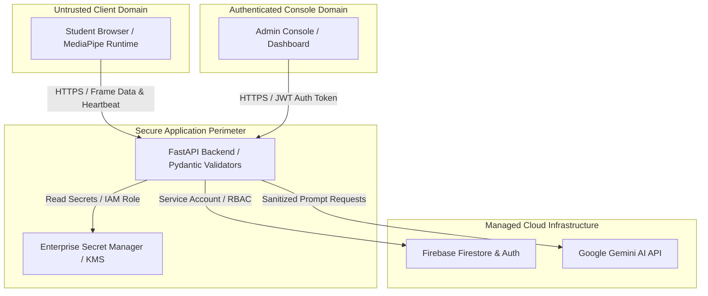

# Security Policy & Threat Model

## Reporting a Vulnerability

If you discover a security vulnerability in SecureEval, please report it responsibly:

1. **DO NOT** open a public GitHub issue for security vulnerabilities.
2. Email your findings to: **security@secureeval.dev** (or open a private security advisory on GitHub).
3. Include a detailed description of the vulnerability, steps to reproduce, and potential impact.
4. You will receive acknowledgment within 24–48 hours.

We appreciate responsible disclosure and will credit reporters (with permission) in our release notes.

---

## Architecture & Trust Boundaries

SecureEval defines five explicit trust boundaries separating client runtimes, application services, and external providers:



| Trust Boundary | Entity | Security Stance | Enforcement Mechanism |
|:---|:---|:---|:---|
| **Boundary 1** | **Student Browser** | **Untrusted** | Treated as completely adversary-controlled. All webcam analysis, trust scores, and answer validations are re-evaluated server-side. Payloads capped at 10MB via Pydantic validators. |
| **Boundary 2** | **Admin Browser** | **Privileged** | Role-Based Access Control (RBAC) enforced via Firebase custom claims (`role: 'admin'`). Client never holds service-account private keys. |
| **Boundary 3** | **FastAPI Backend** | **Application Core** | Runs as non-root `appuser` in hardened Linux containers. Input sanitation, CORS origin filtering, and structured JSON audit logging. |
| **Boundary 4** | **Database & Auth** | **Managed Storage** | Firestore Security Rules isolate document access. Session states become immutable once marked `Completed` or `Terminated`. |
| **Boundary 5** | **AI Inference (Gemini)**| **External Provider** | API communication occurs over TLS 1.3. Student answer strings are wrapped into strict schema boundaries preventing prompt injection. |

---

## Production Secret Management Architecture

SecureEval enforces a strict **Zero-Hardcoded-Secrets** and **Dynamic Secret Injection** architecture across environments:

```
[ Local Development ]       → .env.example template + Git-ignored .env
[ CI / CD Pipelines ]       → GitHub Encrypted Repository Secrets + Gitleaks Gating
[ Production Deployment ]   → GCP Secret Manager / AWS Secrets Manager / HashiCorp Vault
```

### 1. Secret Storage & Ingestion Pattern
- **Local Dev**: Configured using local `.env` files matching `.env.example`. Committed `.gitignore` rules prevent accidental staging of `.env` or credential JSON files.
- **Production Workloads**: The backend loads credentials (`GEMINI_API_KEY`, `FIREBASE_CREDENTIALS`, `JWT_SECRET_KEY`) dynamically at runtime using IAM Workload Identity federation with **GCP Secret Manager** or **AWS Secrets Manager**, avoiding static disk storage.
- **Key Rotation**: Cryptographic API tokens and service account keys follow a mandatory **90-day rotation policy** managed via automated secret versioning.

### 2. Automated Secret Detection & CI Gating
- Automated secret detection is hard-gated in `.github/workflows/ci.yml` using `gitleaks-action`.
- Any pull request or commit introducing high-entropy keys, private certificates, or API tokens fails CI immediately.

---

## Threat Matrix & Mitigations

### 1. Attacker-Controlled Webcam Frames
| Threat | Risk | Mitigation |
|:---|:---:|:---|
| Spoofed webcam feed / virtual camera | High | Server-side face count verification via OpenCV Haar Cascades (defense-in-depth alongside client-side MediaPipe) |
| Oversized or malformed image payloads | Medium | Pydantic `field_validator` enforces max payload size (10 MB) on `FrameData.image`; `cv2.imdecode` validates image format |
| Video frame replay attacks | Medium | Client timestamps and sequence counters matched with backend session drift analysis |

### 2. Session Integrity & Tampering
| Threat | Risk | Mitigation |
|:---|:---:|:---|
| Student modifies answers post-submission | High | Server verifies `status == 'Active'` before processing; once submitted, session status flips to `Completed` and becomes immutable |
| Cross-session student answer injection | High | Firestore security rules enforce `resource.data.studentId == request.auth.uid` |
| Privilege escalation to admin | High | Firebase Admin custom claims (`role: 'admin'`) validated on sensitive routes |

### 3. AI Service Abuse & Prompt Injection
| Threat | Risk | Mitigation |
|:---|:---:|:---|
| Student inputs prompt overriding grader instructions | Medium | Grader prompts isolate student answer inside JSON delimiters; model output is schema-validated via Pydantic |
| External API downtime / rate limiting | Medium | Fallback heuristic grading and structured exception handling in `ai_service.py` |

---

## Security Controls Checklist

- ✅ **No hardcoded secrets** — All sensitive values loaded from environment / Secret Manager
- ✅ **Automated CI Secret Scanning** — `gitleaks-action` integrated and gated on all commits
- ✅ **Firebase security rules** — Role-based access control on all Firestore collections
- ✅ **Strict Input validation** — Pydantic schemas validate all API endpoints
- ✅ **Error sanitization** — Generic API responses returned to clients; detailed traces logged to structured sink only
- ✅ **Dependency auditing** — `pip-audit` and `npm audit --audit-level=high` gated in CI
- ✅ **Non-root Docker execution** — Container runs under unprivileged `appuser` (UID 1000)
- ✅ **CORS filtering** — Configurable whitelist via `CORS_ORIGINS`

---

## Supported Versions

| Version | Security Support Status |
|:---|:---:|
| **2.5.x** | ✅ Active Security Updates |
| < 2.5 | ❌ Deprecated |
